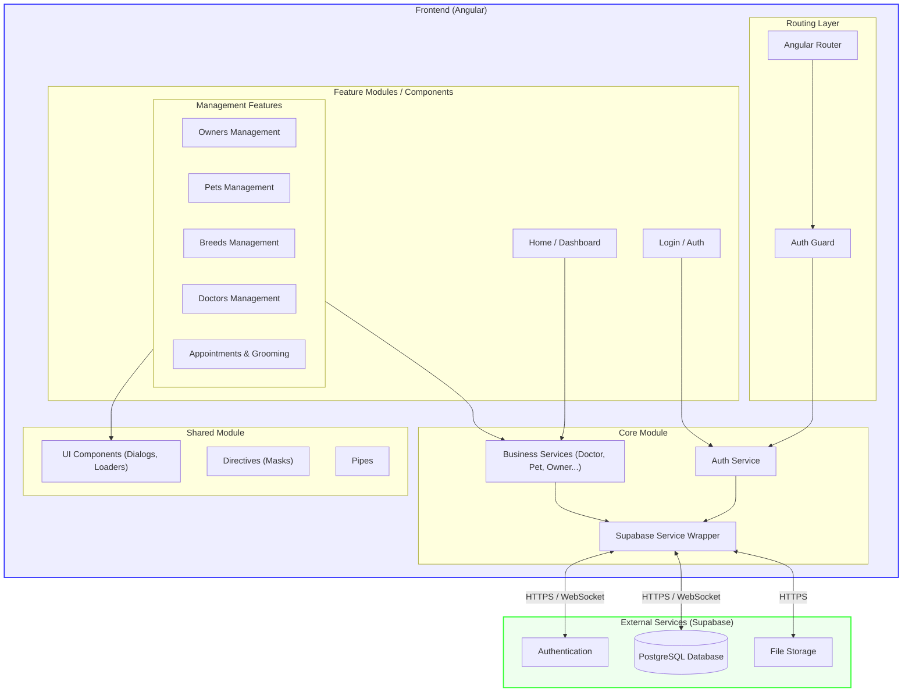

# Diagrama de Arquitetura do App Clinipet

Este documento apresenta a visão geral da arquitetura do aplicativo Clinipet.

## Visão Geral

O Clinipet é uma **Single Page Application (SPA)** construída com **Angular**, utilizando **Supabase** como Backend-as-a-Service (BaaS) para autenticação, banco de dados e armazenamento.

### Principais Camadas

1.  **Camada de Apresentação (Frontend)**: Componentes Angular organizados por funcionalidades (Features).
2.  **Camada de Core (Core Module)**: Serviços singleton, gerenciamento de estado e comunicação com APIs.
3.  **Camada de Dados (Backend)**: Supabase (PostgreSQL + Auth + Storage).

## Detalhes dos Componentes

### 1. Frontend (Angular)
-   **App Component**: Ponto de entrada da aplicação.
-   **Routing**: Gerencia a navegação.
    -   Rota pública: `/login`
    -   Rotas protegidas: `/dashboard`, `/owners`, `/doctors`, etc. (protegidas por `AuthGuard`).
-   **Features**:
    -   Componentes inteligentes (Smart Components) que gerenciam dados e interações.
    -   Carregamento sob demanda (Lazy Loading) para otimização (ex: `owners` module).
-   **Core**:
    -   `SupabaseService`: Encapsula o cliente `supabase-js`, fornecendo uma instância única para toda a aplicação.
    -   `AuthService`: Gerencia login, logout e sessão do usuário.
    -   Serviços de Negócio (`DoctorService`, `PetService`, etc.): Abstraem a lógica de acesso a dados, retornando `Observables` do RxJS.

### 2. Backend (Supabase)
-   **Database**: PostgreSQL gerenciado.
    -   Acesso via API RESTful auto-gerada pelo Supabase (PostgREST).
    -   Regras de segurança (RLS - Row Level Security) controlam o acesso aos dados.
-   **Auth**: Gerenciamento de usuários e JWTs.
-   **Storage**: Armazenamento de arquivos (fotos de perfil, documentos).

## Fluxo de Dados Típico

1.  O **Componente** solicita dados ao **Service** específico (ex: `DoctorService.getDoctors()`).
2.  O **Service** utiliza o **SupabaseService** para montar a query.
3.  O **SupabaseService** se comunica com a API do **Supabase**.
4.  O **Supabase** retorna os dados (JSON) ou erro.
5.  O **Service** processa a resposta e retorna um `Observable` para o componente.
6.  O **Componente** recebe os dados e atualiza a interface.
