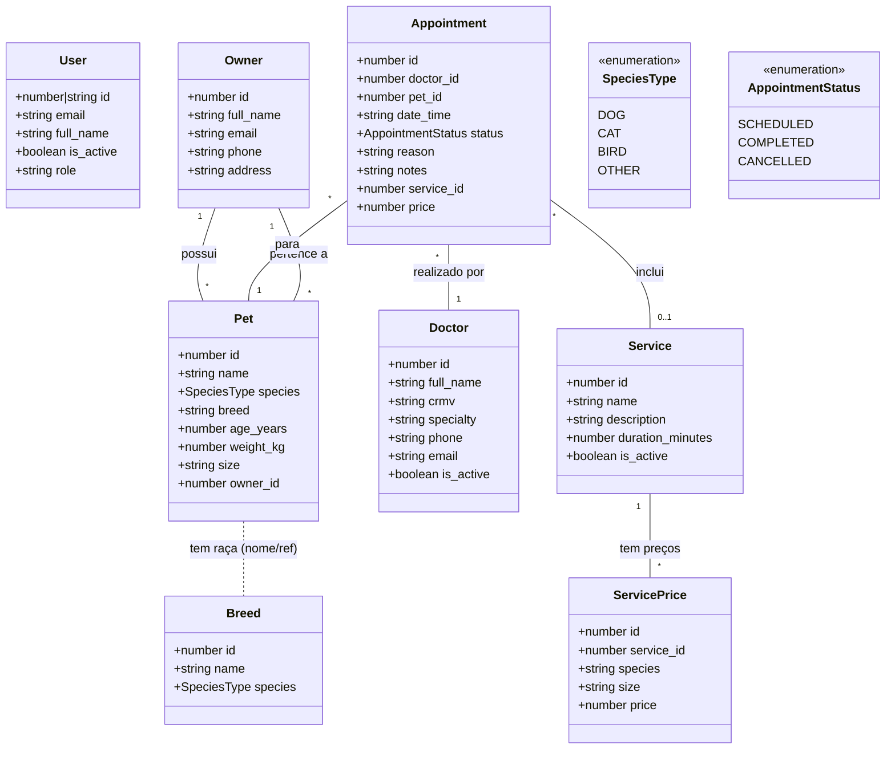

# Diagrama de Classes do App Clinipet

Este documento apresenta o diagrama de classes das principais entidades do sistema Clinipet, baseado nos modelos do frontend.

## Descrição das Entidades

- **User**: Representa os usuários do sistema (administradores, médicos, funcionários) com acesso autenticado.
- **Owner**: Representa os tutores dos pets, contendo informações de contato e endereço.
- **Pet**: Representa os animais atendidos, vinculados a um tutor (Owner).
- **Breed**: Lista de raças disponíveis para cadastro, separadas por espécie.
- **Doctor**: Médicos veterinários que realizam os atendimentos (consultas).
- **Appointment**: Agendamento de consultas ou serviços, vinculando um Pet a um Doctor e opcionalmente a um Serviço.
- **Service**: Catálogo de serviços oferecidos pela clínica (ex: Consulta, Vacina, Banho).
- **ServicePrice**: Tabela de preços dos serviços, podendo variar por espécie e porte do animal.
